# Base

go的一些基础语法知识


## context

context是golang中非常重要的接口，用于定语goroutine中的上下文信息，context常用于以下几种情况：

- 数据传递：在多个goroutine中传递数据

- 超时管理： 通过配置超时时间，可以方便地配置协程的终止时间
- 终止协程： 通过使用 `cancel()` 方法，协程可以很方便地终止，可以批量管理多个协程的终止


### Context接口

```go
// A Context carries a deadline, a cancelation signal, and other values across
// API boundaries.
//
// Context's methods may be called by multiple goroutines simultaneously.
type Context interface {
    Done() <-chan struct{}
    Deadline() (deadline time.Time, ok bool)
    Err() error
    Value(key interface{}) interface{}
}
```


### 根节点和派生节点

可以为context创建根节点和派生节点，为树形结构，当根节点被 `cancel()` 或超时终止时，它的所有派生节点也会被终止，根节点的数据也会被所有派生节点共享。

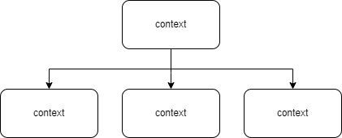

创建根节点

```go
ctx := context.Background() // 创建空白 context
ctx2 := context.TODO() // TODO 同样是空白 context
```

创建派生节点

使用 `context.WithXXX()` 创建派生 `context`

```go
func main() {
	ctx := context.WithValue(context.Background(), "base", "baseVal")
	ctx1 := context.WithValue(ctx, "ctx1", "ctx1Val")
	fmt.Println(ctx)
	fmt.Println(ctx1)
}
// 结果：
// context.Background.WithValue(type string, val baseVal)
// context.Background.WithValue(type string, val baseVal).WithValue(type string, val ctx1Val)
```


### WithValue()

context.WithValue()可以用于创建派生节点并添加键值数据，同时保留父级 context 所有的数据


### WithDeadline&WithTimeout

`context.WithDeadline()` 和 `context.WithTimeout()` 可以用来创建带有超时控制的 `context`

注意:

`WithTimeout(1*time.Second)` 等同于 `WithDeadline(time.Now().Add(1*time.Second))`

源代码：

```go
func WithTimeout(parent Context, timeout time.Duration) (Context, CancelFunc) {
	return WithDeadline(parent, time.Now().Add(timeout))
}
```

**可以看到，对于超时的context而言，他也有cancel函数返回，也是支持手动取消的，但是WithValue就没有这个。**

样例；

```go
func main() {
  ctx, _ := context.WithTimeout(context.Background(), 3*time.Second)
  go func(ctx1 context.Context) {
    for {
      select {
      case <- ctx1.Done():
        fmt.Println("time out")
        return
      default:
        fmt.Println("running")
        time.Sleep(time.Second)
      }
    }
  }(ctx)
  time.Sleep(5 * tims.Second)
}
```

### WithCancel

使用 `WithCancel()` 可以创建手动终止的 `context` 执行 `cancel()` 即可手动终止。举例：

```go
func main() {
  ctx, cancel := context.WithCancel(context.Background())
  go func(ctx1 context.Context) {
    for {
      select {
        case <-ctx1.Done():
        	fmt.Println("canceled")
        	return
        default:
        	fmt.Println("running")
        	time.Sleep(time.Second)
      }
    }
  }(ctx)
  time.Sleep(3 * time.Second)
  cancel()
  time.Sleep(5 * time.Second)
}
```


## Goroutine

Goroutine 是 Go 语言的并发编程模型，它是一种轻量级的线程，由 Go 运行时管理，也可以称之为协程。

优点

- **轻量级**：Goroutine 的栈空间初始大小只有 2KB，可以动态扩容，最大可达 1GB
- **快速启动**：Goroutine 的启动时间只有 1~2us
- **高效调度**：Goroutine 的调度器采用 M:N 模型，可以将 M 个 Goroutine 映射到 N 个 OS 线程上，实现高效调度
- **通信简单**：Goroutine 之间通过 Channel 进行通信，实现数据共享
- **无锁**：Goroutine 之间通过 Channel 进行通信，无需加锁
- **高并发**：Goroutine 可以轻松创建数十万个，实现高并发
- **高性能**：Goroutine 的调度器采用抢占式调度，实现高性能

创建 Goroutine

由于 Goroutine 是 Golang 非常重视的基本功能，因此在 Golang 中创建异步 Goroutine 非常简单，只需要在函数调用前加上 `go` 关键字即可，比绝大部分的编程语言都要简单。

```
func main() {
    go func() {
        for {
            fmt.Println("running...")
            time.Sleep(time.Second)
        }
    }()

    time.Sleep(5 * time.Second)
}
```

使用 `go` 加上任意 `func` 即可创建一个 Goroutine，Goroutine 会在后台执行，不会阻塞主线程。

如何停止 Goroutine

- **运行结束**：Goroutine 会在函数运行结束后自动结束
- **超时结束**：通过 `context.WithTimeout()` 或 `context.WithDeadline()` 可以设置 Goroutine 的超时时间
- **手动结束**：通过 `context.WithCancel()` 可以手动结束 Goroutine
- **通道结束**：通过 Channel 通信，可以结束 Goroutine，上面两种实际也是通道


## Panic & Recover

在 Golang 中，`panic` 和 `recover` 是用于处理异常的两个关键字，`panic` 用于引发异常，`recover` 用于捕获异常。

| 函数                    | 描述                                                         |
| ----------------------- | ------------------------------------------------------------ |
| `panic(interface{})`    | 引发异常，停止当前 `Goroutine` 的执行, 并依次执行当前 `Goroutine` 中的 `defer` 方法 |
| `recover() interface{}` | 捕获异常，返回异常信息；用于处理异常，防止异常导致的程序崩溃，仅可以在 `defer` 中调用 |

作用范围

- `panic`只会触发当前goroutine的defer。
- recover仅在defer中调用有效，在其他地方调用只会返回nil
- panic也可以在defer中调用，可用于处理很多错误，然后返回一个总的新错误。

```go
func main() {
	for i := range 4 {
		go testPanic(i)
	}
	time.Sleep(time.Second)
}

func testPanic(i int) {
	defer func() {
		if r := recover(); r != nil {
			fmt.Println("recover panic: ", i)
			panic("panic in defer")
		}
	}()

	if i == 1 {
		panic(fmt.Sprintf("panic %d", i))
	}

	fmt.Println("test panic: ", i)
}
// test panic:  3
// recover panic:  1
// test panic:  2
// panic: panic 1 [recovered]
//         panic: panic in defer
```

**error**

判断error需要使用`errors.Is`或`errors.As`，而不是用==判断

```go
var ErrCouldNotOpen = errors.New("error")
if errors.Is(err, ErrCouldNotOpen) {
  // handle the error
} else {
  panic("unknown error")
}
```


执行流程

- 编译器将panic转换为runtime包中的gopanic函数并调用
- 将goroutine的defer链表逆序执行（defer的执行可以类比于栈，按照先进后出的顺序执行）
  - 如果defer中没有recover，则执行defer中的代码
  - 如果 `defer` 中有 `recover`，则会调用 `runtime.gorecover`, 将 `panic` 中的 `recovered` 置为 `true`，然后从 `runtime._defer` 中取出程序计数器 `pc` 和栈指针 `sp`，并执行 `runtime.recovery` 恢复程序，最后调用 `runtime.deferproc` 返回 `1`，表示 `recover` 成功。
  - `panic` 的 `deferreturn` 字段置为 `true`，表示 `defer` 已经执行完毕

- 如果所有 `defer` 中都没有 `recover()`， 则程序会执行 `runtime.fatalpanic` 终止运行

不可以捕获的异常

- 内存溢出： 当预分配空间过大导致内存溢出时，会返回 `runtime: out of memory`, 无法通过 `recover` 捕获恢复
- map 并发读写: 当 map 并发读写时，会返回 `concurrent map read and map write`, 无法通过 `recover` 捕获恢复
- 栈内存耗尽: 当栈内存耗尽时，会返回 `runtime: goroutine stack exceeds 1000000000-byte limit`, 无法通过 `recover` 捕获恢复
- Goroutine运行时错误: 运行时环境错误，会返回 `runtime: goroutine running on NULL machine`, 无法通过 `recover` 捕获恢复
- 全部Goroutine休眠: 当全部 Goroutine 休眠时，会返回 `all goroutines are asleep - deadlock!`, 无法通过 `recover` 捕获恢复，其实就是channel操作不当导致死锁了。

可以捕获的异常

- 数组越界: 当数组越界时，会返回 `panic: runtime error: index out of range`, 可以通过 `recover` 捕获恢复
- 空指针引用: 当空指针引用时，会返回 `panic: runtime error: invalid memory address or nil pointer dereference`, 可以通过 `recover` 捕获恢复
- 类型断言失败: 当类型断言失败时，会返回 `panic: interface conversion: interface {} is nil, not int`, 可以通过 `recover` 捕获恢复
- 除数为0: 当除数为0时，会返回 `panic: runtime error: integer divide by zero`, 可以通过 `recover` 捕获恢复
- 调用不存在的方法: 当调用不存在的方法时，会返回 `panic: runtime error: invalid memory address or nil pointer dereference`, 可以通过 `recover` 捕获恢复


## GMP调度器

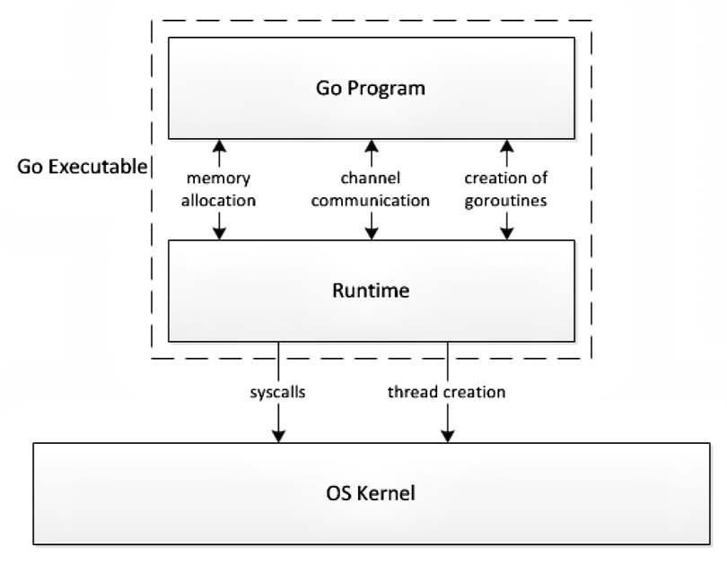

通过上图可以看到，操作系统内核和写的逻辑代码之间通过runtime进行交互，runtime会调用操作系统的系统调用，操作系统来调用硬件资源，以此来运行程序。

所谓的scheduler就是负责调度goroutine的模块，他会根据一定的策略来调度goroutine的执行，这样才能保证goroutine的执行顺序和并发度。其使用的模型是GMP模型。

**GMP 模型是 Go 语言调度器的核心模型，它是 Go 语言调度器的基础。**GMP 模型构成：

| **组件**      | **描述**                                                     |
| ------------- | ------------------------------------------------------------ |
| G (Goroutine) | 表示一个 Goroutine，包含栈和相关的上下文信息                 |
| M (Machine)   | 表示一个执行线程（真正的内核线程），负责将 Goroutine 映射到操作系统的线程上。每个 M 都有自己的调用栈和寄存器状态 |
| P (Processor) | 表示一个逻辑处理器，维护一个处于可运行状态的 Goroutine 队列，每个 M 都和一个 P 相关联 |

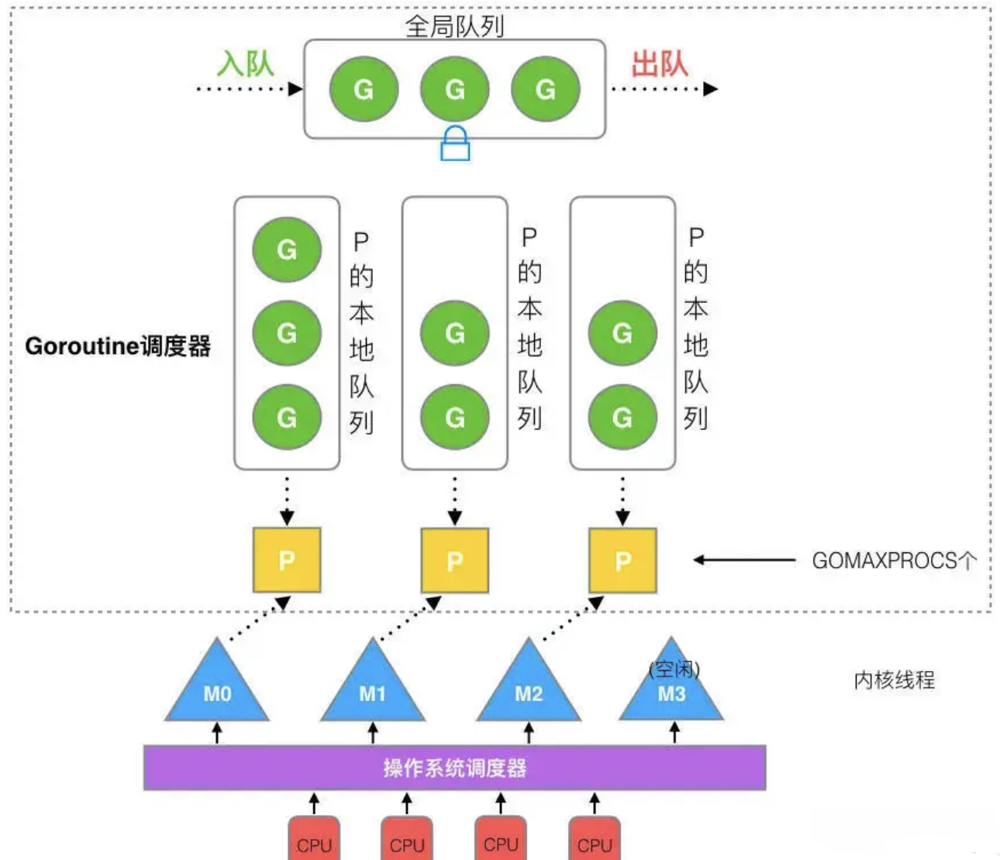

- **全局队列RRQ**(global runnable queue)：存放所有正在等待运行的`G`
- **本地队列LRQ**(local runnable queue)：每个`P`都有一个本地队列，用于存放当前 `P` 等待和正在运行的 `G`，每个 `P` 的本地队列中最多存放 `256` 个 `G` 。创建 `G` 时，会优先放入本地队列，如果本地队列满了， 则会将队列中一半的 `G` 移动到全局队列中。

- **P 的数量**：`P` 的数量是固定的，由 `GOMAXPROCS` 决定，即最大并发数, 默认为 `CPU` 核数。可以通过`runtime.GOMAXPROCS(runtime.NumCPU())`更新值，他会返回之前的值，默认就是`runtime.NumCPU()`.
- **M 的数量**：`M` 的数量是动态的，由调度器决定，根据当前的负载情况动态调整, GO默认设置为 10000，实际上内核很难达到该限制，可以认为是没有限制。`M` 想要运行任务就需要获取 `P`，如果没有 `P`，`M` 就会阻塞。如果 `P` 的本地队列为空，`M` 会从全局队列中获取 `G`，放入本地队列。 如果全局队列也为空，`M` 会从其他随机一个 `P` 的本地队列中获取一半的 `G` 放到本地队列中。


调度器策略

- 抢占式调度 ：在协程中需要一个协程主动让出 CPU 下一个协程才能使用 CPU， 而 Goroutine 规定一个 Goroutine 每次最多只能占用 10ms 的 CPU，然后就要切换到下一个, 防止其他协程长时间不被执行
- 复用线程 ：Go 语言的调度器会复用线程，而不是每次都创建新的线程，这样可以减少线程创建和销毁的开销，提高性能。
  - **工作偷取(Work stealing)**:当 `M` 没有可运行的 `G` 时，会尝试从其他线程绑定的 `P` 的本地队列中偷取一半的 `G`来运行，而不是销毁 `M` 
  - **挂起机制(Hand off)**: 当 `G` 由于系统调用而阻塞时, `M` 会释放绑定的 `P` 供其他 `M` 使用
- 并行：通过 `GOMAXPROCS` 配置 `P` 的数量，从而实现并行执行，`P` 的数量决定了并行度，`P` 的数量等于 CPU 核数时，可以实现最大并行度。
- 全局队列 ：当本地队列中没有可运行的 `G`， `M` 会先去全局队列尝试获取 `G`， 若全局队列中没有待运行的 `G` 则会尝试去其他 `P` 的本地队列中偷取 `G`

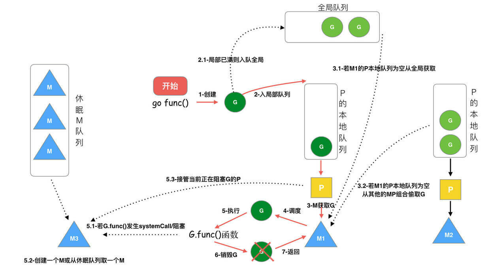

流程：

- 创建一个 `G`：如果本地队列没满，则随机放入一个未满的本地队列，否则放入全局队列。

- 执行 `G`：`P` 会获取一个 `G` 在 `M` 中执行，若 `G` 产生 `systemCall` 阻塞，则会将 `M` 放入休眠队列，如果当前有一些 G 在执行，runtime 会把这个线程 M 从 P 中摘除 (detach)，然后再创建一个新的操作系统的线程 (如果有空闲的线程可用就复用空闲线程) 来服务于这个 P；

- 获取 `G`：若本地队列中 `G` 已经执行完，则尝试从从全局队列中获取 `G`，若全局队列中没有可运行的 `G`， 则从其他 `P` 的本地队列中偷取 `G`

> 常见的阻塞：IO select，系统调用，channel，mutex，sleep

生命周期：

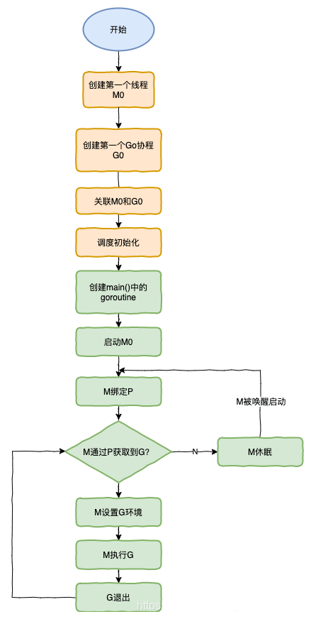

特殊的 M0 和 G0

- M0：M0 是启动程序后的编号为 0 的主线程，这个 M 对应的实例会在全局变量 runtime.m0 中，不需要在 heap 上分配，M0 负责执行初始化操作和启动第一个 G， 在之后 M0 就和其他的 M 一样了。
- G0：G0 是每次启动一个 M 都会第一个创建的 gourtine，G0 是仅用于负责调度的 G，G0 不指向任何可执行的函数，每个 M 都会有一个自己的 G0。在调度或系统调用时会使用 G0 的栈空间，全局变量的 G0 是 M0 的 G0。


## 垃圾回收

### 常见垃圾回收策略

**引用计数法**

- 基本思想
  - 给对象中添加一个引用计数字段，每当有一个地方引用它时，计数加 1；当引用失效时，计数减 1；当计数为 0 时，表示对象不再被使用，可以被回收。
- 优点
  - 无需遍历，不需要从根节点遍历，相对容易查找
  - 立即回收垃圾，每个对象始终知道自己的被引用次数，一旦引用计数为 0，就会立即将自身连接到空闲链表上，等待回收
  - 最大限度地减少程序暂停时间，在 mutator 更新引用计数时，就会触发垃圾回收，不需要等到内存耗尽时才触发，因此不会出现程序暂停时间过长的情况
- 缺点:
  - 无法解决循环引用问题
  - 每次引用计数发生变化时都需要修改计数器，引起额外的开销
  - 需要额外的空间存储计数器


追踪回收算法：共包含三种策略：标记-清除（mark-sweep），标记-整理（mark-compact），标记-复制（mark-copying）算法，这三种都需要有STW。

标记-清除算法

- 基本思想：
  - 从根对象出发，递归遍历所有可达对象，将可达对象标记为存活对象
  - 遍历堆中所有对象，将未标记的对象回收
- 优点:
  - 可以解决循环引用问题
  - 不需要额外的空间存储计数器
- 缺点:
  - 在清除阶段会产生大量的碎片，导致内存碎片化，可能会导致程序运行分配对象时找不到连续的内存空间而再次触发垃圾回收
  - 执行效率不稳定

**标记-复制算法**

- 工作原理：
  - 从根对象出发，递归遍历所有可达对象，将可达对象标记为存活对象
  - 将堆划分成两个相等的区域：使用区和未使用区
  - 在程序运行时只将对象放到使用区，当使用区满时，执行垃圾回收，遍历使用区的所有对象，判断存活对象并将存活对象移动至未使用区，然后清空使用区。最后将本两块区域的角色进行交换，即未使用区变成使用区，使用区变成未使用区
- 优点:
  - 可以解决内存碎片化问题，每次执行垃圾回收都会将存活对象移动至未使用区，对象都是连续存放的
  - 执行效率相对较高，由于只需要复制存活对象，清除未存活对象是批量操作，因此需要的时间相对较短，吞吐率更高
  - 快速分配内存，由于内存是连续的，因此分配内存时只需要移动指针即可，相比其他算法使用的是空闲链表，连续内存分配效率更高
- 缺点:
  - 空间利用率低，相同的内存空间下，只有一半的空间可以用来存放对象
  - 递归效率低，由于需要递归遍历并复制所有可达对象，相比于迭代效率较低，且需要额外的栈开销，可能导致内存溢出

**标记-整理算法**

- 工作原理：
  - 从根对象出发，递归遍历所有可达对象，将可达对象标记为存活对象
  - 将存活对象移动至堆的一端，然后清除未存活对象
- 优点:
  - 空间利用率高
  - 相对于标记-复制算法来说空间利用率更高，不会浪费一半的空间
- 缺点:
  - 执行效率较低，在将存活对象移动至堆的一端时，需要更多的时间, 当对象非常多时，暂停时间会比其他两种策略还要长


### GO的垃圾回收

Go中采用最简单的“标记-清除”，“标记有用的对象，清除无用的对象”，采用广度优先搜索算法，从**根集合出发**，进行可达性分析，标记有用对象。为了减少GC对性能的影响，Go现在的版本支持并发进行垃圾回收。采用的标记法为三色标记法。

根集合是GC在标记过程中**最先检查**的对象。主要包括：

- 全局变量：在程序编译期间就能确定，全局变量存在于程序的整个生命周期。
- 执行栈：Go语言中协程是分配在堆上，每个协程都含有自己的执行栈。
- 寄存器：寄存器的值可能表示一个指针，这些指针可能指向另一块内存空间。

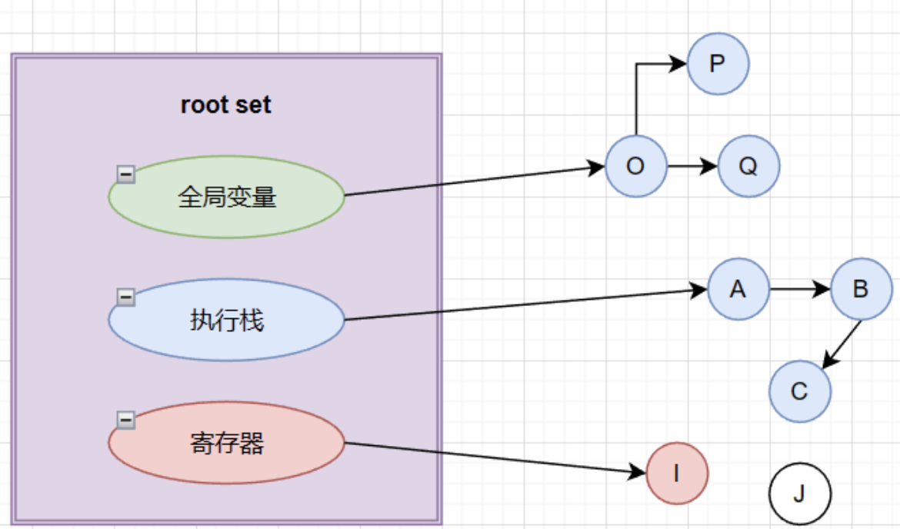

#### 三色标记算法

三色标记算法改进了标记-清除算法，将标记-清除算法的两个阶段（标记和清除）分解为三个阶段（标记、标记终止和清除），减少了 `STW` 的时间。

三种对象

- 白色：未访问，可能是需要回收的对象
- 灰色：访问中，自身被访问，但是子对象未被访问
- 黑色：访问完成，自身和子对象都被访问

工作原理

- 在垃圾回收开始时将根对象标记为灰色
- 在灰色对象中选择一个对象标记为黑色，然后将其子对象标记为灰色
- 将黑色对象指向的所有白色对象标记为灰色
- 重复步骤2和3，直到没有灰色对象
- 清除所有白色对象

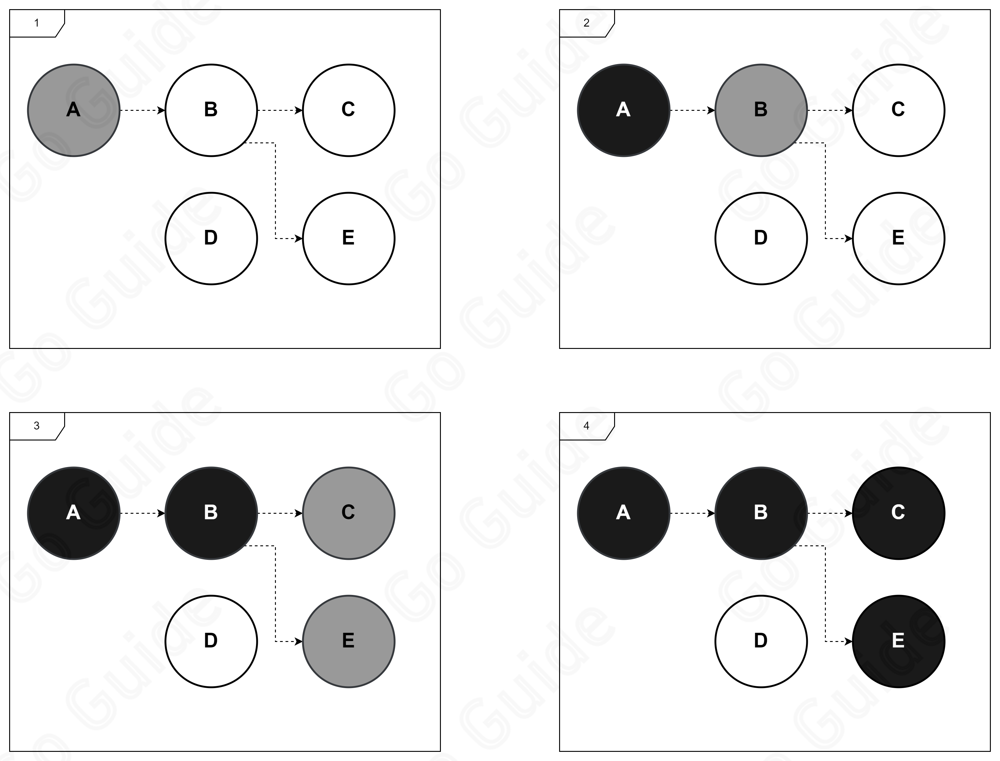

三色标记正确的前提，需要达成以下一种三色不变性：

强三色不变性：在标记阶段，黑色对象不会指向白色对象

弱三色不变性：在标记阶段中，黑色对象指向的白色对象（G）必须包含一条灰色对象经过一个或多个白色对象后到达白色对象（G）的路径

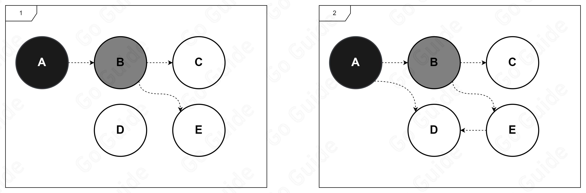


这种算法还是需要STW的，并发情况下，会产生标记错误，最终导致垃圾回收错误。

为了减少STW时间，能够使得垃圾回收并发进行，Golang引入了屏障技术，通过屏障技术可以在对象状态发生变化时，可以让垃圾回收器感知到，并正确处理。


#### 屏障技术

插入屏障

当一个对象 `A` 添加了对另一个对象 `B` 的引用时，会在 `A` 的引用列表中插入一个 `B` 的引用，并且将 `B` 标记为灰色。

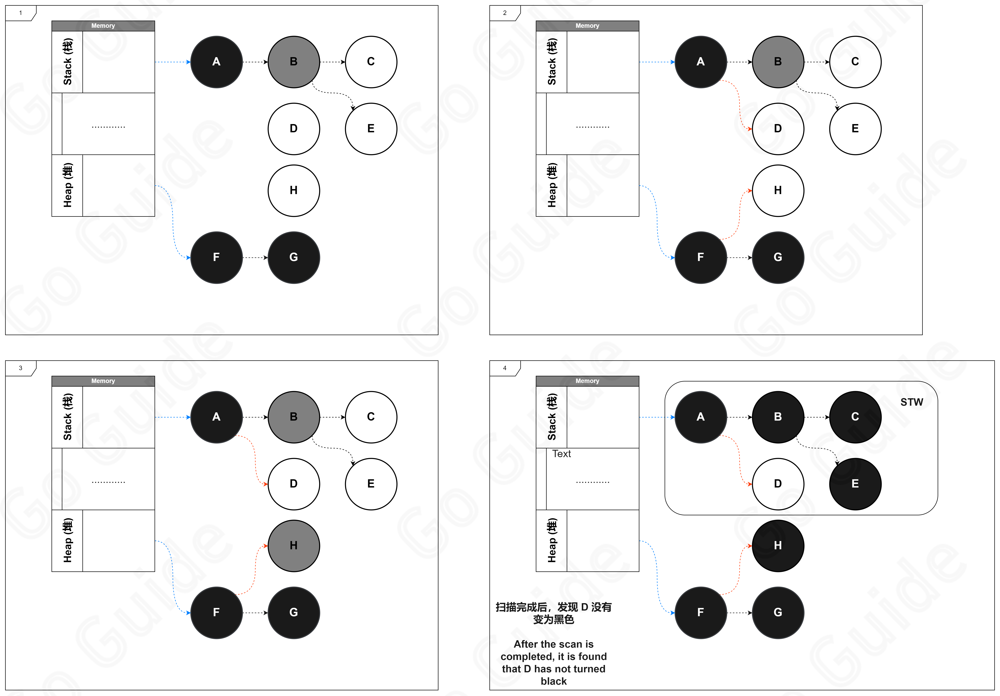

注意，插入屏障只会发生在堆中，所以对于栈中的D不会标记为灰色，需要再一次STW重新扫描，才能将D标记为黑色。

删除屏障

当一个对象 `A` 删除了对另一个对象 `B` 的引用时，会在 `A` 的引用列表中删除一个 `B` 的引用，如果 `B` 是白色的，则将 `B` 标记为灰色。

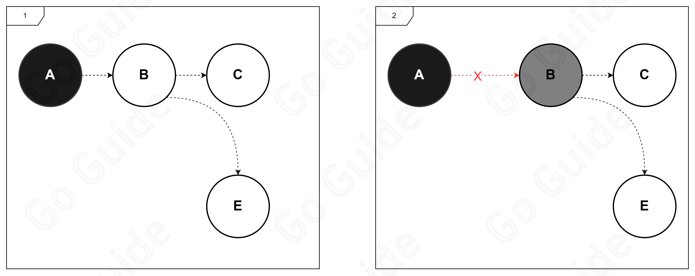

插入屏障和删除屏障有以下缺点：

- 插入屏障在扫描结束后还需要 `STW` 一次，将栈内对象重新扫描一遍
- 删除屏障回收精度较低，在回收开始时需要 `STW` 一次，将栈内对象扫描一遍，记录初始快照，保护初始时刻所有存活的对象

**混合写屏障**

为了解决上述问题， `Golang` 引入了混合写屏障，混合写屏障是插入屏障和删除屏障的结合，可以在对象状态发生变化时，通知垃圾回收器。

工作原理

1. 在垃圾回收开始时将栈上的对象全部扫描并标记为黑色（不进行二次扫描）
2. 在垃圾回收期间任何栈上创建的对象都会标记为黑色，避免了二次扫描
3. 在垃圾回收期间删除任何的对象都会标记为灰色
4. 在垃圾回收期间创建的任何对象都会标记为灰色

目前整个GC流程会进行两次STW(Stop The World), 第一次是Mark阶段的开始, 第二次是Mark Termination阶段.
第一次STW会准备根对象的扫描, 启动写屏障(Write Barrier)和辅助GC(mutator assist).
第二次STW会重新扫描部分根对象, 禁用写屏障(Write Barrier)和辅助GC(mutator assist).
需要注意的是, 不是所有根对象的扫描都需要STW, 例如扫描栈上的对象只需要停止拥有该栈的G.
写屏障的实现使用了Hybrid Write Barrier, 大幅减少了第二次STW的时间.

看不明白，先记下吧=_=。


## 锁

### 互斥锁

互斥锁是一种最基本的锁，它的作用是保证在同一时刻只有一个 goroutine 可以访问共享资源。在 Go 语言中，互斥锁由 `sync` 包提供，使用 `syns.Mutex` 结构体来表示。

```go
// 初始化互斥锁
mu := sync.Mutex{}
// 上锁
mu.Lock()
// 解锁
mu.UnLock()
```

- `Lock()` 后如果再次执行 `Lock()` 第二个 `Lock()` 会阻塞，造成死锁，导致异常退出
- 如果没有 `Lock()` 却执行 `UnLock()` 则会触发 `panic` ，导致异常退出
- 互斥锁的性能开销较大，因为每次加锁和解锁都需要调用系统内核函数，所以在性能要求较高的场景下，可以考虑使用读写锁


### 读写锁

读写锁是一种特殊的锁，它分为读锁和写锁。读锁可以被多个 goroutine 同时持有，但是写锁只能被一个 goroutine 持有。在 Go 语言中，读写锁由 `sync` 包提供，使用 `sync.RWMutex` 结构体来表示。

```go
// 初始化读写锁
rw := sync.RWMutex{}
// 读锁
rw.RLock()
// 读解锁
rw.RUnlock()
// 写锁
rw.Lock()
// 写解锁
rw.Unlock()
```

- `Lock` 和 `Unlock`, `RLock()`和`RUnlock()` 必须成对出现，否则会导致死锁
- `Lock` 不能同时执行两次，会导致死锁
- `RWLock` 在传参时必须使用指针传递，不能使用值传递副本
- `RWLock` 是不可重入锁，不能获取了写锁后，再获取读锁。也就是没有写锁降级这种说法。

读-写者问题

- 读者优先 （readers-preference）
  - 读者优先指的是读的操作优先于写的操作，当有读操作时，写操作会被阻塞，但是读操作不会被阻塞。只有所有的读者都释放了读锁，写操作才能进行。
- 写者优先 （writers-preference）
  - 写者优先指的是写的操作优先于读的操作，当有写操作时，当前的读者可以继续进行读操作，但是不允许新的读者进行读操作，当前读者完成读取操作后，写者会进行写入操作，只有写者完成写入操作后，新的读者才能进行读操作。

注意

- 读者优先在频繁读取的系统中会导致写者长时间阻塞导致写饥饿
- 写者优先在频繁写入的系统中会导致读者长时间阻塞导致读饥饿
- **Golang 的 `sync.RWMutex` 是写者优先的，优先处理写的操作**


## 原子操作

什么是原子操作?

原子操作是一种不可分割的操作，要么全部执行成功，要么全部执行失败。在针对内存中某个值的操作时，原子操作可以确保在并发环境下不会出现数据竞争，其他 goroutine 无法在操作进行中对该值进行读写。

在 Golang 中， 针对原子操作，可以使用 `sync/atomic` 包提供的原子操作函数。这些函数可以确保在并发环境下对共享资源进行安全的读写。

**原子操作的实现原理是通过 `CPU` 提供的原子指令来实现的，这些指令可以确保在执行过程中不会被中断，从而保证操作的原子性。由于大多数 `CPU` 的原子操作都是基于 `32` 位或 `64` 位的寄存器，所以 `Golang` 原子操作的范围也仅限于这两种类型。**

注意

实际上，原子操作也可以通过加锁来实现，但是加锁操作涉及到**内核态**的上下文切换，会有比较大的性能消耗，而原子操作是在**用户态**完成的，性能更高，效率可能相差几倍。

**互斥锁和原子操作的区别**

- 互斥锁通常用于保护一段代码，只有一个 `goroutine` 可以访问这段代码，其他 `goroutine` 需要等待， 而原子操作通常用于保护一个变量，确保在并发环境下对变量的读写是安全的。
- 互斥锁是一种悲观锁，它认为并发访问是一种常态，所以会在访问前先加锁，而原子操作是一种乐观锁，它认为并发访问是一种特例，所以会先尝试进行操作，如果失败再进行重试。
- 互斥锁是一种重量级锁，它会涉及到内核态的上下文切换，性能消耗较大，而原子操作是一种轻量级锁，它是在用户态完成的，性能更高。
- 互斥锁有操作系统的调度器实现， 而原子操作则是有硬件提供的原子指令实现，无需加锁而实现并发安全。

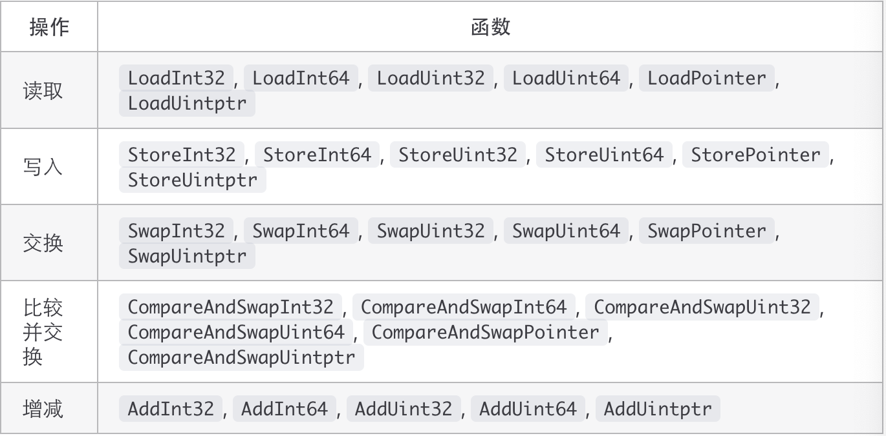

使用示例

```go
var count int64 = 0

func main() {
	wg := sync.WaitGroup{}
	start := time.Now()
	for _ = range 10000 {
		wg.Add(1)
		go func() {
			atomic.AddInt64(&count, 1)
			wg.Done()
		}()
	}

	wg.Wait()

	fmt.Printf("time cost: %v, count: %d", time.Since(start), count)
}
```

其实atomic包提供了一些常用的数据类型供我们使用：`atomic.Int32{}`，`atomic.Int64{}`，`atomic.Bool	{}`等，提供的api的内部都是使用了上面的原子操作函数来实现的。

对于常用的`sync.map{}`，他内部是靠锁和原子操作一同实现的。


## 闭包

闭包是由函数和与其相关的引用环境组合而成的实体。简单来说，闭包就是一个引用了作用域之外的变量的函数（Func），该函数的存在时间可以超过创建他的作用域。和JS中的一样。

```go
count := func() func() int {
  i := 0 // 初始化函数内变量
  return func() int {
    i ++ // 函数内变量加 1
    return i
  }
}()

fmt.Println(count())
fmt.Println(count())
```


### 使用场景

**中间件**

在定义 web 中间件时经常会看到以下形式的代码:

```go
func makeHandler(fn func(http.ResponseWriter, *http.Request, string)) http.HandlerFunc {
    return func(w http.ResponseWriter, r *http.Request) {
        m := validPath.FindStringSubmatch(r.URL.Path)
        if m == nil {
            http.NotFound(w, r)
            return
        }
        fn(w, r, m[2]) // 如果没问题则继续执行 fn
    }
}
```

可以看到, 返回值是 `http.HandlerFunc`, 这个函数里面调用了 fn, 这样的话就可以实现链式操作，既执行了中间件代码，又可以继续执行函数，非常方便。


**状态共享**

闭包可以用来共享多次执行函数的状态，常见的例子是迭代器。

```go
func main() {
    iterator := func(list []int) func() (int, bool) {
       i := -1
       return func() (int, bool) {
          i++
          if i >= len(list) {
             return 0, false
          }
          return list[i], true
       }
    }
    ints := []int{1, 2, 3, 4, 5}
    iter := iterator(ints)
    for {
       v, ok := iter()
       if !ok {
          break
       }
       fmt.Println(v)
    }
}
```


**回调函数**

可以通过传参，实现传入回调函数

```go
func GetData(data int, callback func(int)) {
    go func() {
        result := data + 2
        callback(result)
    }
}
```


**函数工厂**

通过闭包还可以构造函数工厂，通过传入参数返回对应函数。

```go
func main() {
	factory := CalculationFactory("ADD")
	fmt.Println(factory(1, 2))
}

func CalculationFactory(t string) func(int, int) int {
	switch t {
	case "ADD":
		return func(a, b int) int {
			return a + b
		}
	case "MUL":
		return func(a, b int) int {
			return a * b
		}
	case "SUB":
		return func(a, b int) int {
			return a - b
		}
	case "DIV":
		return func(a, b int) int {
			return a / b
		}
	case "MOD":
		return func(a, b int) int {
			return a % b
		}
	default:
		return func(a, b int) int {
			return a + b
		}
	}
}
```

可以传入 `ADD` 获取加法函数，`DIV` 获取除法函数。


## byte&rune

`byte` 和 `rune` 都是用于表示字符的类型，但它们之间有一些区别：

类型不同：

- `byte` ：字节，是 `uint8` 的别名类型
- `rune` ：字符，是 `int32` 的别名类型

存储的字符不同：

```go
//byte 用于表示 ASCII 码字符，只能存储 0-255 范围内的字符。
var a byte = 'Y'  // ASCII 码字符

//rune 用于表示 Unicode 字符，可以存储任意 Unicode 字符。
var b rune = '酥'  // Unicode 字符
```

占用的字节大小不同：byte 占用1个字节，rune 占用4个字节

```go
import "unsafe"
var a byte = 'Y'
var b rune = '酥'
fmt.Printf("a 占用 %d 个字节数\nb 占用 %d 个字节数", unsafe.Sizeof(a), unsafe.Sizeof(b))
// 输出: a 占用 1 个字节数 b 占用 4 个字节数
```


## new&make

`new` 用于给任意的类型分配内存地址，并返回该类型的指针，且初始化值为**零值**。注意new一个引用类型，他指针指向是nil。

> new一般用于生成一个值类型的指针变量

```go
func main() {
	s := new(string)
	n := new(int)

	fmt.Println(s) // 0xc00008a030
	fmt.Println(*s) // ""

	fmt.Println(n) // 0xc00000a0d8
	fmt.Println(*n) // 0
  
  c := new(map[int]int)
	*c = make(map[int]int, 10)
	fmt.Println(*c) // 还是需要再一次make初始化的
}
```

`make` 主要用于引用数据类型 `slices` `map` `channel` 的初始化

```go
func main() {
	m := make(map[string]int, 10)
	fmt.Println(m) // map[]
}
```


